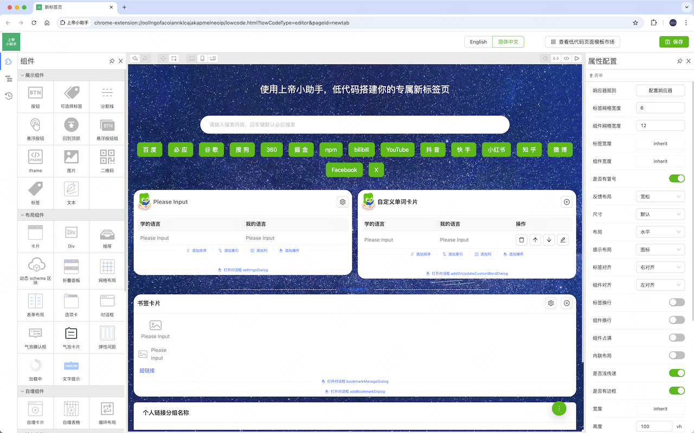
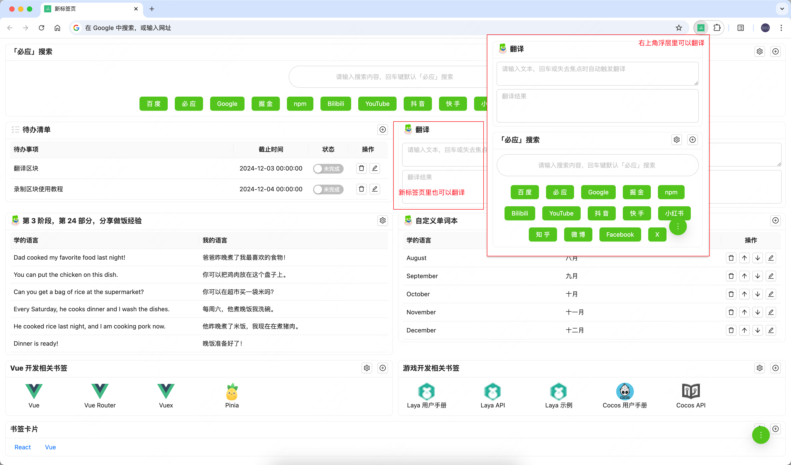

# 上帝小助手浏览器扩展程序

- [0-查看视频教程](#0-查看视频教程)
- [1-功能介绍](#1-功能介绍)
- [2-安装和更新扩展](#2-安装和更新扩展)
  - [2.1-安装扩展](#21-安装扩展)
  - [2.2-更新扩展](#22-更新扩展)
- [3-功能说明](#3-功能说明)
  - [3.1-使用低码搭建页面](#31-使用低码搭建页面)
  - [3.2-本扩展对外暴露的浏览器接口](#32-本扩展对外暴露的浏览器接口)
- [4-欢迎扫下方二维码咨询或反馈问题](#4-欢迎扫下方二维码咨询或反馈问题)

## 0-查看视频教程

- 在哔哩哔哩中查看
  - [1-个人介绍，为什么要做上帝小助手浏览器插件/扩展开发平台](https://www.bilibili.com/video/BV1wy1yYDEnL)
  - [2-上帝小助手功能介绍](https://www.bilibili.com/video/BV1JM1yYLEe8)
  - [3-安装上帝小助手](https://www.bilibili.com/video/BV1WF1yYQEGd)
  - [4-更新上帝小助手](https://www.bilibili.com/video/BV1Eu1yYyE9h)
  - [5-使用上帝小助手定制个人专属新标签页和小组新标签页](https://www.bilibili.com/video/BV1c82kYjEXH)

- 在 YouTube 中查看
  - [1-个人介绍，为什么要做上帝小助手浏览器插件/扩展开发平台](https://www.youtube.com/watch?v=FcpJoSvHEe4)
  - [2-上帝小助手功能介绍](https://www.youtube.com/watch?v=3Eyub74FSPU)
  - [3-安装上帝小助手](https://www.youtube.com/watch?v=SKysPdxW_x4)
  - [4-更新上帝小助手](https://www.youtube.com/watch?v=yitVi3I-hrY)
  - [5-使用上帝小助手定制个人专属新标签页和小组新标签页](https://www.youtube.com/watch?v=vg7uwPwuzf0)

## 1-功能介绍

上帝小助手浏览器扩展程序是一个浏览器扩展开发平台

- 为用户提供了一个低代码搭建平台，用户可以通过低代码的方式快速搭建自己的专属新标签页，以及搭建各种自动化任务页面





- 用户可以添加各种自动化任务脚本


## 2-安装和更新扩展

### 2.1-安装扩展

1、下载 [god-assistant-0.1.6.zip](https://raw.githubusercontent.com/bingoogolapple/bga-god-assistant-config/main/god-assistant-0.1.6.zip) 文件到本地，并解压

2、在 Chrome 或 Microsoft Edge 中打开「chrome://extensions/」

3、打开开发者模式 -> 加载已解压的扩展程序


4、选择第 1 步中解压得到的目录后，扩展就算安装完成了


5、建议将该扩展固定在浏览器顶部，方便后续能快速去编辑页面


### 2.2-更新扩展

1、当扩展发布新版本后，用户在打开当前扩展的任意页面时，都会展示如下所示的升级提示弹窗，用户只需选择之前安装扩展时选择的安装目录即可升级扩展来使用最新功能


2、更新扩展需要申请扩展安装目录的写权限，所以需要用户允许修改文件


## 3-功能说明

### 3.1-使用低码搭建页面

1、在扩展图标上右键选择「选项」或「扩展选项」打开扩展的配置项页面


2、然后就可以增删改你的专属浏览器页面了


### 3.2-本扩展对外暴露的浏览器接口

浏览器为扩展程序提供了很多 API [API 参考](https://developer.chrome.com/docs/extensions/reference/api?hl=zh-cn)，上帝小助手浏览器扩展中提供了 `$chrome.callMethodByPath` 方法来执行原本的浏览器提供的 API

- 例子 1：监听点击事件

```js
$props({
  onClick: () => {
    $message.info("TODO 处理点击事件");
  },
});
```

- 例子 2：获取插件清单文件信息

```js
$props({
  onClick: async () => {
    // 方式一
    const manifest1 = await $chrome.runtime.getManifest();
    alert(JSON.stringify(manifest1, null, 2));
    // 方式二
    const manifest2 = await $chrome.callMethodByPath("runtime.getManifest");
    alert(JSON.stringify(manifest2, null, 2));
  },
});
```

- 例子 3：写入缓存和读取缓存

```js
$props({
  onClick: async () => {
    // 写入缓存-方式1
    await $chrome.storage.local.set({
      key1: `${new Date().toLocaleString()}`,
      key2: `${Math.random()}`,
    });
    // 写入缓存-方式2
    await $chrome.callMethodByPath("storage.local.set", {
      key3: `${new Date().toLocaleString()}`,
      key4: `${Math.random()}`,
    });

    // 读取缓存-方式1
    const result1 = await $chrome.storage.local.get(["key1", "key2"]);

    // 读取缓存-方式2
    const result2 = await $chrome.callMethodByPath("storage.local.get", [
      "key1",
      "key2",
    ]);

    $message.success(JSON.stringify({ result1, result2 }));
  },
});
```

- 例子 4：获取当前激活的标签页

```js
$props({
  onClick: async () => {
    // 方式1
    const tab1 = await $chrome.tabs.query({
      active: true,
      lastFocusedWindow: true,
    });
    alert(JSON.stringify(tab1));
    // 方式2
    const tab2 = await $chrome.callMethodByPath("tabs.query", {
      active: true,
      lastFocusedWindow: true,
    });
    alert(JSON.stringify(tab2));
  },
});
```

- 例子 5：操作系统通知

```js
$props({
  onClick: () => {
    let myNotificationId;

    // 创建系统通知
    $chrome.notifications.create(
      null,
      {
        type: "basic",
        title: "我是标题",
        message: "我是内容",
        iconUrl: "../images/128.png",
      },
      $chrome.proxy((notificationId) => {
        myNotificationId = notificationId;
        $message.info(`创建的系统通知 ID 为 ${notificationId}`);
      })
    );

    // 延迟 3 秒更新系统通知
    setTimeout(() => {
      $chrome.notifications.update(
        myNotificationId,
        {
          type: "basic",
          title: "我是修改后的标题",
          message: "我是修改后内容",
          iconUrl: "../images/128.png",
        },
        $chrome.proxy((wasUpdated) => {
          $message.info(`更新系统通知 ${wasUpdated}`);
        })
      );
    }, 3000);

    // 延迟 6 秒清除系统通知
    setTimeout(() => {
      $chrome.notifications.clear(
        myNotificationId,
        $chrome.proxy((wasCleared) => {
          $message.info(`清除系统通知 ${wasCleared}`);
        })
      );
    }, 6000);
  },
});
```

## 4-欢迎扫下方二维码咨询或反馈问题

### 微信

| 扫码加「微信群」咨询或反馈问题                                       | 扫码关注「微信公众号」查看视频教程                             | 扫码加「作者微信」咨询或反馈问题                              |
| -------------------------------------------------------------------- | -------------------------------------------------------------- | ------------------------------------------------------------- |
|  |  |  |

### QQ

| 扫码加「QQ 群」咨询或反馈问题                                   | 扫码在「QQ 短视频」查看视频教程                                 | 扫码加「作者 QQ」咨询或反馈问题                                |
| --------------------------------------------------------------- | --------------------------------------------------------------- | -------------------------------------------------------------- |
|  |  |  |
